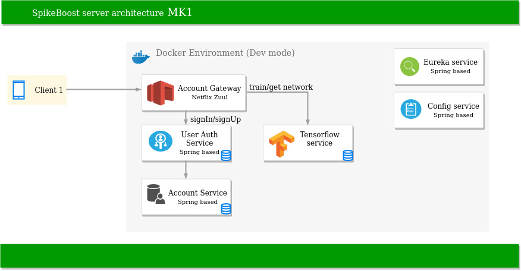

# SpikeBoost Server Part

Project helps to automate process of music selection while current active activity of user.
Since first stage of development relates mostly to PoC, only basic functionality will be supported:
1) user authorization
2) providing of trained neural-network to end-user
3) upload of trained results to train next level of neural-network

Trello board: https://trello.com/b/ay9yWtE9/sbp-server

## Description
Current server's concept approximately looks:

Soundtracks music will be kept locally on client side. Once a physical activity has been finished the server can receive
post request with training details. Usually training details contains a list of soundtracks which were playing during
a training. Including other sort of data, next training of neural-network can be started. Finally, a new version of neural network
can be sent back to client-side.

Two major problems must be solved by the server:
1) gathering of certain data quantity for training
2) performing of training process

## Technical Stack
1) Java 11
2) Spring Boot: 2.1.4.RELEASE
3) Spring Cloud: Greenwich.SR4
4) Junit 5
5) Mockito
6) Docker-Compose: 3.7

## How To Run
1) In Project root folder: mvn clean install
2) Run docker-compose, docker-compose-dev scripts: docker-compose -f docker-compose.yml -f docker-compose.dev.yml up -d --build
3) Wait until all services are run

## Testing
All tests are rotating around working with rest-end points. Last ones can be divided on couple groups:
1) user end points
2) neural-network training end points

A detailed scheme and examples of requests are not yet ready but will be prepared quite soon.

## License
MIT
